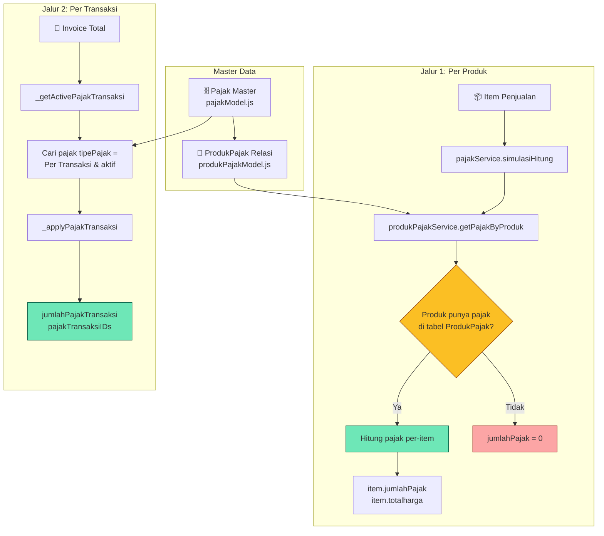
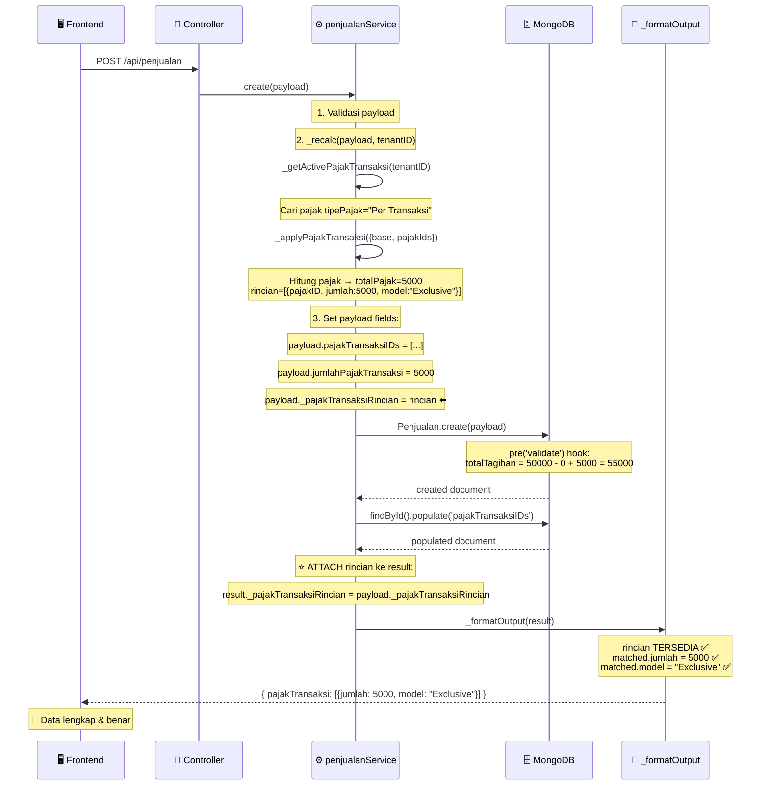
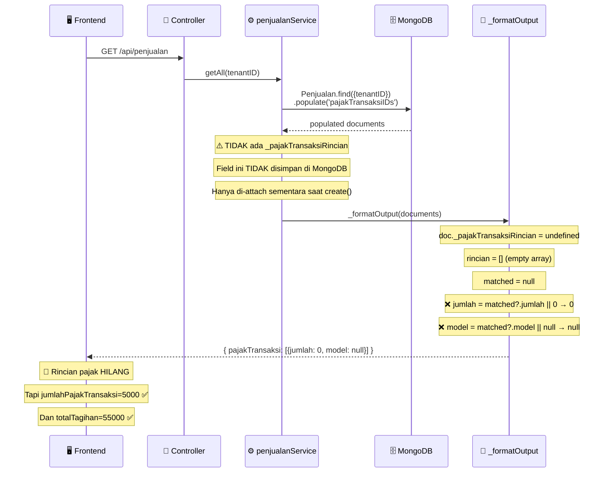

# 🐛 Bug Report: Pajak Transaksi Rincian Hilang pada `getAll()` / `getById()`

> **Severity:** 🟡 Medium — Kalkulasi keuangan aman, tapi rincian pajak per-entry tampil `0` di frontend  
> **Module:** `penjualanService.js` → `_formatOutput()`  
> **Root Cause:** `_pajakTransaksiRincian` hanya di-attach sementara saat `create()`, tidak disimpan ke database  
> **Affected:** Semua client yang memanggil `GET /api/penjualan` atau `GET /api/penjualan/:id`  
> **Reporter:** Frontend Team — terdeteksi via debug logging di Flutter app

---

## 📋 Daftar Isi

- [Executive Summary](#-executive-summary)
- [Arsitektur Pajak Backend](#-arsitektur-pajak-backend-overview)
- [Alur Normal yang Benar](#-alur-normal-yang-benar-create)
- [Alur yang Bermasalah](#-alur-yang-bermasalah-getall--getbyid)
- [Bukti dari Production Log](#-bukti-dari-production-log)
- [Analisis Kode](#-analisis-kode)
- [Impact pada Frontend](#-impact-pada-frontend)
- [Kasus Nyata di Frontend](#-kasus-nyata-di-frontend)
- [Proposed Fix](#-proposed-fix)
- [Testing Checklist](#-testing-checklist)

---

## 📌 Executive Summary

Ketika invoice dibuat (`POST /api/penjualan`), backend menghitung pajak transaksi dengan benar dan mengembalikan rincian lengkap:

```json
{
  "jumlahPajakTransaksi": 5000,
  "totalTagihan": 55000,
  "pajakTransaksi": [
    { "namaPajak": "PPN", "tarifPajak": 10, "jumlah": 5000, "model": "Exclusive" }
  ]
}
```

Namun ketika invoice **diambil kembali** via `GET /api/penjualan` (dashboard, laporan, dll), rincian per-entry **hilang**:

```json
{
  "jumlahPajakTransaksi": 5000,
  "totalTagihan": 55000,
  "pajakTransaksi": [
    { "namaPajak": "PPN", "tarifPajak": 10, "jumlah": 0, "model": null }
  ]
}
```

`jumlahPajakTransaksi` dan `totalTagihan` tetap benar (tersimpan di DB), tapi **rincian per pajak** (`jumlah` dan `model`) hilang.

---

## 🏗️ Arsitektur Pajak Backend Overview

Sistem pajak memiliki **2 jalur penerapan** yang berbeda:



### Tabel Pajak Master (`pajakModel.js`)

| Field | Type | Values | Keterangan |
|-------|------|--------|------------|
| `namaPajak` | String | "PPN", "PPh", dll | Nama pajak |
| `tarifPajak` | Number | 10, 11, 15, dll | Persentase tarif |
| `tipePajak` | Enum | `"Per Produk"` / `"Per Transaksi"` | Menentukan jalur penerapan |
| `modelPerhitungan` | Enum | `1` / `2` / `3` | Model kalkulasi (lihat bawah) |
| `statusPajak` | Boolean | true/false | Aktif atau tidak |
| `prioritas` | Enum | `1` / `2` | Urutan kalkulasi |

### Model Perhitungan

| Kode | Nama | Formula | Keterangan |
|------|------|---------|------------|
| `1` | **Inklusif** | `pajak = base - (base / (1 + tarif/100))` | Pajak sudah **termasuk** dalam harga |
| `2` | **Eksklusif** | `pajak = hargaDasar × (tarif/100)` | Pajak **ditambahkan** di atas harga |
| `3` | **Compound** | `pajak = runningTotal × (tarif/100)` | Pajak dihitung dari total berjalan (termasuk pajak sebelumnya) |

### Formula Total Tagihan (di `penjualanModel.js` pre-validate hook)

```
totalTagihan = grandTotalItem - jumlahDiskonTransaksi + jumlahPajakTransaksi
```

Di mana:
- `grandTotalItem` = Σ `item.totalharga` (sudah termasuk pajak per-produk jika ada)
- `jumlahDiskonTransaksi` = Total diskon global
- `jumlahPajakTransaksi` = Total pajak per-transaksi

---

## ✅ Alur Normal yang Benar (`create`)



---

## 🐛 Alur yang Bermasalah (`getAll` / `getById`)



---

## 📊 Bukti dari Production Log

### Backend Terminal — Saat `_recalc` (CREATE)

```
[_recalc] ═══════ PAJAK TRANSAKSI ═══════
[_recalc] grandTotalItem (sum item.totalharga) = 50000
[_recalc] diskonGlobal = 0
[_recalc] dasarSetelahDiskon = 50000
[_recalc] Active pajak transaksi IDs: ["69b2496ce67f1fa7c8b0bfbf"] (1 found)
[_recalc] ✅ Pajak transaksi result:
[_recalc]   totalPajak = 5000
[_recalc]   appliedIds = ["69b2496ce67f1fa7c8b0bfbf"]
[_recalc]   rincian = [{"pajakID":"69b2496ce67f1fa7c8b0bfbf","namaPajak":"pajak","tarif":10,"jumlah":5000,"model":"Exclusive"}]
[_recalc] 📊 FINAL: totalTagihan akan = 50000 - 0 + 5000 = 55000
```

### Frontend — Saat CREATE Response (benar ✅)

```
[Invoice._terbitkan] 📥 JumlahPajakTransaksi: 5000.0
[Invoice._terbitkan] 📥 TotalTagihan: 55000.0
[Invoice._terbitkan] 📥 PajakTransaksi (dari backend): 1 entries
[Invoice._terbitkan]   💰 pajak (10%) = Rp 5000  model=Exclusive     ← ✅ BENAR
```

### Frontend — Saat Dashboard GETALL (rincian hilang ❌)

```
[InvoiceDashboard] 📥 Total invoice: 15
[InvoiceDashboard]   [0] INV/TKA/20260312/121133473 | totalTagihan=55000.0 | pajak=5000.0
[InvoiceDashboard]       💰 pajak 10% = Rp 0 (model: null)           ← ❌ BUG
```

### Frontend — Saat Buka Detail dari Dashboard (rincian tetap 0 ❌)

```
[InvoiceDetail] 📝 TotalTagihan: 55000.0                              ← ✅ TOTAL BENAR
[InvoiceDetail] 📝 JumlahPajakTransaksi: 5000.0                       ← ✅ AGGREGATE BENAR
[InvoiceDetail] 📊 Taxes: 1
[InvoiceDetail]   💰 pajak (10.0% Eksklusif) = Rp 0                   ← ❌ RINCIAN SALAH
```

---

## 🔍 Analisis Kode

### Kode yang Bermasalah: `_formatOutput()` (line 85–112)

```javascript
// penjualanService.js — _formatOutput()

const pajakTransaksi = pajakTransaksiIDs.map((pajak, index) => {
  // 🐛 BUG: doc._pajakTransaksiRincian HANYA ada saat create()
  // Saat getAll() / getById() → undefined → rincian = []
  const rincian = Array.isArray(doc._pajakTransaksiRincian)
    ? doc._pajakTransaksiRincian
    : [];                              // ← SELALU [] saat getAll/getById

  const matched =
    rincian.find((r) => String(r.pajakID) === String(pajak._id || pajak)) ||
    rincian[index] ||
    null;                              // ← SELALU null saat getAll/getById

  if (pajak && typeof pajak === "object") {
    return {
      _id: pajak._id,
      namaPajak: pajak.namaPajak,
      tarifPajak: pajak.tarifPajak,
      jumlah: matched?.jumlah || 0,    // ← 0 karena matched null ❌
      model: matched?.model || null,    // ← null karena matched null ❌
    };
  }
  // ...
});
```

### Penyebab: `create()` attach sementara (line 607)

```javascript
// penjualanService.js — create() (line 607)

const result = await Penjualan.findById(created._id)
  .populate('pajakTransaksiIDs', '...')
  .lean();

// ⭐ Hanya di sini _pajakTransaksiRincian di-attach
// Field ini BUKAN bagian dari PenjualanSchema → TIDAK tersimpan di MongoDB
result._pajakTransaksiRincian = payload._pajakTransaksiRincian || [];

return this._formatOutput(result);  // ← rincian tersedia saat create
```

### Yang TIDAK melakukan attach: `getAll()` (line 507) dan `getById()` (line 549)

```javascript
// penjualanService.js — getAll() (line 507)

const penjualans = await Penjualan.find({ tenantID })
  .populate('pajakTransaksiIDs', '...')
  .lean();

// ⚠️ TIDAK ada: penjualans._pajakTransaksiRincian = ...
formatted = this._formatOutput(penjualans);  // ← rincian TIDAK tersedia
```

---

## 💥 Impact pada Frontend

### Perbandingan Data yang Diterima Frontend

| Skenario | `jumlahPajakTransaksi` | `totalTagihan` | `pajakTransaksi[0].jumlah` | `pajakTransaksi[0].model` |
|----------|----------------------|----------------|---------------------------|--------------------------|
| **Setelah `create()`** | ✅ 5000 | ✅ 55000 | ✅ 5000 | ✅ "Exclusive" |
| **Dashboard `getAll()`** | ✅ 5000 | ✅ 55000 | ❌ 0 | ❌ null |
| **Detail `getById()`** | ✅ 5000 | ✅ 55000 | ❌ 0 | ❌ null |

### Apa yang User Lihat

```
╔══════════════════════════════════════════════════╗
║  Detail Invoice — INV/TKA/20260312/121133473     ║
╠══════════════════════════════════════════════════╣
║                                                  ║
║  Subtotal             :    Rp 50.000             ║
║  ─────────────────────────────────               ║
║  PPN 10% (Eksklusif)  :    Rp 0       ← ❌ BUG  ║
║  Total Pajak           :    Rp 5.000   ← ✅ OK   ║
║  ─────────────────────────────────               ║
║  Total Tagihan         :    Rp 55.000  ← ✅ OK   ║
║                                                  ║
╚══════════════════════════════════════════════════╝
```

User melihat kontradiksi: "PPN 10% = Rp 0" tapi "Total Pajak = Rp 5.000". Ini membingungkan dan menurunkan kepercayaan user terhadap sistem.

---

## 🧪 Kasus Nyata di Frontend

### Skenario 1: Pajak "Per Transaksi" Diubah Menjadi "Per Produk"

**Kronologi:**
1. Admin membuat pajak "PPN 10%" sebagai `tipePajak: "Per Transaksi"`
2. Invoice INV-001 dibuat → `totalTagihan: 55000` (termasuk PPN 5000) ✅
3. Admin **mengubah** pajak "PPN 10%" menjadi `tipePajak: "Per Produk"`
4. Frontend buka dashboard → fetch `getAll()`
5. Invoice INV-001 masih menampilkan:
   - `jumlahPajakTransaksi: 5000` ✅ (dari DB)
   - `pajakTransaksi: [{jumlah: 0, model: null}]` ❌ (rincian hilang)

**Impact:** User tidak bisa melihat breakdown pajak apa saja yang diterapkan pada invoice lama.

### Skenario 2: Multiple Pajak Transaksi

Jika tenant punya 2 pajak Per Transaksi (PPN 10% + PPh 2.5%):

**Saat `create()` response:**
```json
{
  "jumlahPajakTransaksi": 6250,
  "pajakTransaksi": [
    { "namaPajak": "PPN", "jumlah": 5000, "model": "Exclusive" },
    { "namaPajak": "PPh", "jumlah": 1250, "model": "Exclusive" }
  ]
}
```

**Saat `getAll()` response:**
```json
{
  "jumlahPajakTransaksi": 6250,
  "pajakTransaksi": [
    { "namaPajak": "PPN", "jumlah": 0, "model": null },
    { "namaPajak": "PPh", "jumlah": 0, "model": null }
  ]
}
```

Frontend tidak bisa menampilkan breakdown masing-masing pajak berapa — hanya tahu totalnya 6250.

### Skenario 3: Cetak Ulang Faktur / Invoice PDF

Jika ada fitur cetak PDF yang mengambil data via `getById()`, maka:
- Total tagihan → benar
- Tapi baris pajak di PDF → "PPN 10%: Rp 0" ← **fatal untuk dokumen resmi/fiskal**

---

## 🛠️ Proposed Fix

### Opsi A: Simpan `_pajakTransaksiRincian` ke Database (Recommended)

Tambahkan field `pajakTransaksiRincian` di `PenjualanSchema`:

```javascript
// penjualanModel.js — tambahkan di schema
pajakTransaksiRincian: [
  {
    pajakID: { type: mongoose.Schema.Types.ObjectId, ref: "Pajak" },
    namaPajak: { type: String },
    tarif: { type: Number },
    jumlah: { type: Number, default: 0 },
    model: { type: String, enum: ["Inclusive", "Exclusive", "Compound"] },
  },
],
```

Update `_recalc()` untuk set field ini:

```javascript
// penjualanService.js — _recalc(), setelah _applyPajakTransaksi
payload.pajakTransaksiRincian = pajakTransaksiRes.rincian;  // ← Simpan ke DB
```

Update `_formatOutput()` untuk pakai field dari DB:

```javascript
// penjualanService.js — _formatOutput()
const rincian = Array.isArray(doc.pajakTransaksiRincian)
  ? doc.pajakTransaksiRincian               // ← Dari DB (selalu ada)
  : Array.isArray(doc._pajakTransaksiRincian)
    ? doc._pajakTransaksiRincian             // ← Fallback legacy
    : [];
```

**Pro:** Data persisten, selalu tersedia, backward compatible  
**Con:** Migrasi data existing, sedikit storage tambahan

### Opsi B: Hitung Ulang di `_formatOutput()` (Quick Fix)

Jika `matched` null, hitung ulang dari `jumlahPajakTransaksi` dan `tarifPajak`:

```javascript
// Di _formatOutput, ketika matched null
if (pajak && typeof pajak === "object") {
  const jumlahCalculated = matched?.jumlah ||
    Math.round((doc.jumlahPajakTransaksi || 0) * (pajak.tarifPajak / totalTarif));
  
  return {
    _id: pajak._id,
    namaPajak: pajak.namaPajak,
    tarifPajak: pajak.tarifPajak,
    jumlah: jumlahCalculated,
    model: matched?.model ||
      (pajak.modelPerhitungan === 1 ? "Inclusive" :
       pajak.modelPerhitungan === 2 ? "Exclusive" : "Compound"),
  };
}
```

**Pro:** Tidak perlu migrasi, quick fix  
**Con:** Kalkulasi bisa berbeda dari aslinya jika pajak master sudah diubah sejak invoice dibuat

---

## ✅ Testing Checklist

Setelah fix diterapkan, pastikan test skenario berikut:

- [ ] **Create invoice** dengan 1 pajak Per Transaksi → response `pajakTransaksi[0].jumlah` > 0
- [ ] **Create invoice** dengan 2+ pajak Per Transaksi → semua entry punya `jumlah` dan `model`
- [ ] **`GET /api/penjualan`** (getAll) → semua invoice punya `pajakTransaksi[n].jumlah` yang benar
- [ ] **`GET /api/penjualan/:id`** (getById) → rincian pajak lengkap
- [ ] **Redis cache** → hapus cache setelah fix, pastikan data fresh
- [ ] **Backward compatibility** → invoice lama yang sudah ada tetap bisa diambil tanpa error
- [ ] **Edge case: pajak master dihapus** → `pajakTransaksiIDs` populate return null → handle gracefully
- [ ] **Edge case: pajak master diubah tarif** → rincian yang tersimpan tetap sesuai saat invoice dibuat

---

## 📁 File yang Terlibat

| File | Lokasi | Relevance |
|------|--------|-----------|
| `penjualanService.js` | `services/penjualanService.js` | ⚡ **Primary** — `_formatOutput`, `create`, `getAll`, `getById` |
| `penjualanModel.js` | `models/penjualanModel.js` | Schema + pre-validate hook |
| `pajakModel.js` | `models/pajakModel.js` | Master data pajak |
| `pajakService.js` | `services/pajakService.js` | `simulasiHitung`, `#calculateTaxLogic` |
| `produkPajakModel.js` | `models/produkPajakModel.js` | Relasi produk ↔ pajak |
| `produkPajakService.js` | `services/produkPajakService.js` | `getPajakByProduk`, `assignPajak` |

---

> **Catatan:** Bug ini terdeteksi saat debugging di frontend Flutter menggunakan kDebugMode logging.
> Total dan kalkulasi keuangan tetap benar — yang bermasalah hanya rincian per-entry pajak saat read operations.
