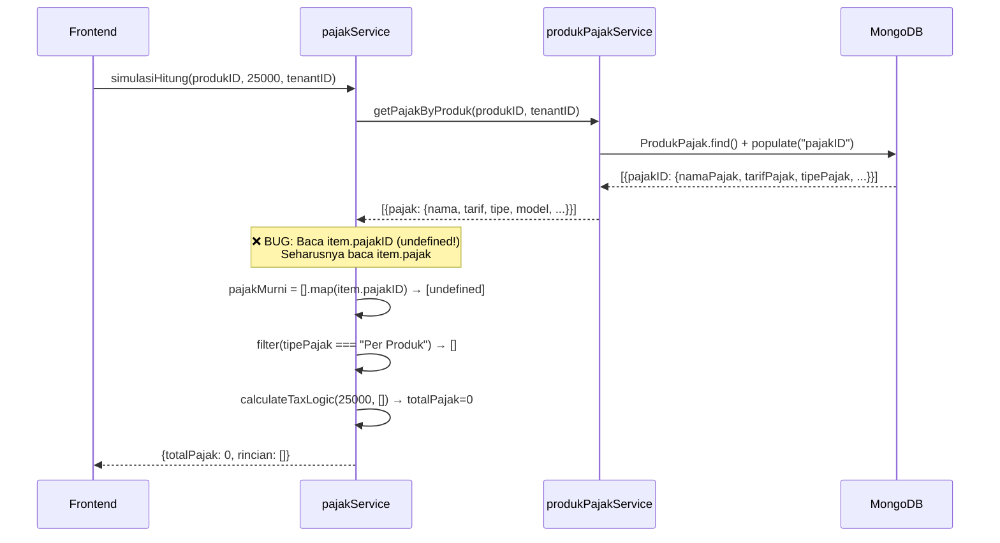
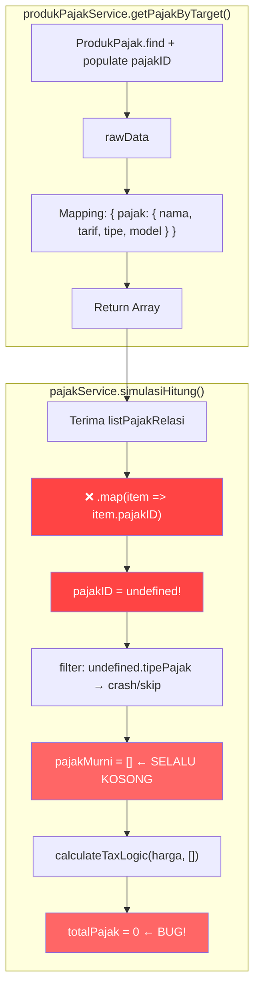

# 🐛 BUG REPORT: `simulasiHitung()` Selalu Return `totalPajak: 0`

> **Severity:** 🔴 **CRITICAL** — Pajak Per Produk **tidak pernah dihitung**, baik di simulasi maupun saat pembuatan invoice  
> **Ditemukan:** 12 Maret 2026  
> **File Terdampak:** `services/pajakService.js` → fungsi `simulasiHitung()`  
> **Impact:** Semua invoice yang menggunakan produk dengan pajak "Per Produk" **tidak dikenakan pajak**, padahal assignment pajak sudah ada di database

---

## 📋 Daftar Isi

- [Executive Summary](#executive-summary)
- [Bukti dari Production Log](#bukti-dari-production-log)
- [Diagram Alur Bug](#diagram-alur-bug)
- [Analisis Kode: Akar Masalah](#analisis-kode-akar-masalah)
- [Data Flow Comparison](#data-flow-comparison)
- [Impact Analysis](#impact-analysis)
- [Proposed Fix](#proposed-fix)
- [Testing Checklist](#testing-checklist)

---

## Executive Summary

Fungsi `simulasiHitung()` di `pajakService.js` **selalu mengembalikan `totalPajak: 0`** dan `rincian: []` untuk semua produk, meskipun produk tersebut sudah di-assign pajak "Per Produk" melalui tabel `ProdukPajak`.

**Akar masalah:** Terjadi **field-name mismatch** (ketidakcocokan nama field) antara output dari `produkPajakService.getPajakByProduk()` dan apa yang dibaca oleh `simulasiHitung()`.

```
getPajakByProduk() mengembalikan:  { pajak: { nama, tarif, tipe, model } }
simulasiHitung() membaca:          item.pajakID.tipePajak  ← UNDEFINED!
```

---

## Bukti dari Production Log

### 1. Produk "makanan" SUDAH punya pajak (dari GET /api/produk)

```
pajakList: [
  { _id: "69b257e6e67f1fa7c8b0c0d6", namaPajak: "pajak produk" }
]
```

### 2. Relasi ProdukPajak SUDAH ada (dari GET /api/produkpajak/:id)

```json
{
  "success": true,
  "data": [{
    "_id": "69b257fde67f1fa7c8b0c0f2",
    "produkID": "69b18bf55016ed40fcaf290b",
    "pajak": {
      "_id": "69b257e6e67f1fa7c8b0c0d6",
      "nama": "pajak produk",
      "tarif": 10,
      "tipe": "Per Produk",
      "prioritas": 1,
      "model": "Exclusive"
    }
  }]
}
```

### 3. Tapi simulasi RETURN 0 (dari POST /api/pajak/simulasi)

```json
{
  "success": true,
  "message": "Simulasi perhitungan berhasil",
  "data": {
    "hargaAwal": 25000,
    "totalPajak": 0,          // ← HARUSNYA 2500!
    "grandTotal": 25000,       // ← HARUSNYA 27500!
    "rincian": []              // ← HARUSNYA ADA 1 PAJAK!
  }
}
```

### 4. Invoice yang dibuat juga SALAH

```
itemPenjualan: [{
  namaProduk: "makanan",
  jumlah: 2,
  subTotal: 50000,
  rincianPajak: [],     // ← KOSONG
  jumlahPajak: 0,       // ← HARUSNYA 5000
  totalharga: 50000      // ← HARUSNYA 55000
}]
```

---

## Diagram Alur Bug

### Alur yang SEHARUSNYA terjadi:



### Posisi bug dalam arsitektur:



---

## Analisis Kode: Akar Masalah

### File 1: `produkPajakService.js` → `getPajakByTarget()` (line 44-78)

Fungsi ini melakukan mapping dari raw DB data ke format bersih:

```javascript
// OUTPUT dari getPajakByTarget():
return rawData
  .filter((item) => item.pajakID?.statusPajak === true)
  .map((item) => ({
    _id: item._id,
    ...(item.produkID && { produkID: item.produkID }),
    pajak: {                          // ← FIELD NAME: "pajak"
      _id: item.pajakID._id,
      nama: item.pajakID.namaPajak,   // ← "nama" bukan "namaPajak"
      tarif: item.pajakID.tarifPajak, // ← "tarif" bukan "tarifPajak"
      tipe: item.pajakID.tipePajak,   // ← "tipe" bukan "tipePajak"
      prioritas: item.pajakID.prioritas,
      model: "Exclusive",             // ← STRING bukan NUMBER (1/2/3)
    },
  }));
```

> **Perhatikan:** Output menggunakan field `pajak` (bukan `pajakID`) dan field di dalamnya di-rename (`nama`, `tarif`, `tipe`, `model` bukan `namaPajak`, `tarifPajak`, `tipePajak`, `modelPerhitungan`).

### File 2: `pajakService.js` → `simulasiHitung()` (line 78-99)

```javascript
const pajakMurni = listPajakRelasi
  .map((item) => item.pajakID)         // ❌ HARUSNYA item.pajak
  .filter((item) => item && item.tipePajak === "Per Produk");  
  // ❌ HARUSNYA item.tipe === "Per Produk"

return this.#calculateTaxLogic(hargaCustom, pajakMurni);
```

### File 3: `pajakService.js` → `#calculateTaxLogic()` (line 18-76)

Fungsi ini mengharapkan object dengan field:

| Expected Field | Yang Ada di `pajak` | Match? |
|---|---|---|
| `statusPajak` | *(tidak ada, sudah di-filter)* | ❌ |
| `prioritas` | `prioritas` | ✅ |
| `namaPajak` | `nama` | ❌ |
| `tarifPajak` | `tarif` | ❌ |
| `modelPerhitungan` | `model` (STRING!) | ❌ |

---

## Data Flow Comparison

```
┌─────────────────────────────────────────────────────────────────┐
│                    RAW DATA (dari MongoDB + populate)            │
│  item.pajakID = {                                               │
│    _id: "69b257e6...",                                          │
│    namaPajak: "pajak produk",                                   │
│    tarifPajak: 10,                                              │
│    tipePajak: "Per Produk",                                     │
│    modelPerhitungan: 2,                                         │
│    statusPajak: true,                                           │
│    prioritas: 1                                                 │
│  }                                                              │
└──────────────────────────┬──────────────────────────────────────┘
                           │
          getPajakByTarget() MELAKUKAN MAPPING
                           │
                           ▼
┌─────────────────────────────────────────────────────────────────┐
│              OUTPUT dari getPajakByTarget()                      │
│  {                                                              │
│    _id: "69b257fd...",                                          │
│    produkID: "69b18bf5...",                                     │
│    pajak: {                    ← KEY = "pajak" bukan "pajakID"  │
│      _id: "69b257e6...",                                        │
│      nama: "pajak produk",     ← "nama" bukan "namaPajak"      │
│      tarif: 10,                ← "tarif" bukan "tarifPajak"    │
│      tipe: "Per Produk",       ← "tipe" bukan "tipePajak"      │
│      model: "Exclusive",       ← STRING bukan NUMBER (2)       │
│      prioritas: 1                                               │
│    }                                                            │
│  }                                                              │
└──────────────────────────┬──────────────────────────────────────┘
                           │
          simulasiHitung() MEMBACA SALAH
                           │
                           ▼
┌─────────────────────────────────────────────────────────────────┐
│              simulasiHitung() BACA: item.pajakID                │
│                                                                 │
│  item.pajakID → undefined  ❌ (seharusnya item.pajak)           │
│                                                                 │
│  undefined.tipePajak → cannot read property → SKIP              │
│  pajakMurni = [] ← SELALU KOSONG                                │
│                                                                 │
│  calculateTaxLogic(25000, []) → totalPajak = 0                  │
└─────────────────────────────────────────────────────────────────┘
```

---

## Impact Analysis

### 🔴 Dampak CRITICAL

| Komponen | Dampak | Keterangan |
|---|---|---|
| **POST /api/pajak/simulasi** | ❌ Selalu return 0 | Frontend tidak bisa preview pajak per-produk |
| **POST /api/penjualan (create)** | ❌ Pajak per-produk = 0 | `_recalc()` memanggil `simulasiHitung()` yang sama → semua invoice tidak dikenakan pajak per-produk |
| **PUT /api/penjualan (update)** | ❌ Pajak per-produk = 0 | Sama — `_recalc()` juga dipanggil saat update |
| **totalTagihan** | ❌ Kurang dari seharusnya | Tidak termasuk pajak per-produk |
| **Laporan Keuangan** | ❌ Underreported | Total pajak di semua laporan kurang |

### 📊 Contoh Dampak Finansial

```
Produk: makanan (Rp 25.000)
Pajak Per Produk: 10% = Rp 2.500
Qty: 2

SEHARUSNYA:
  subTotal    = Rp 50.000
  jumlahPajak = Rp  5.000  (2 × Rp 2.500)
  totalharga  = Rp 55.000

AKTUAL (BUG):
  subTotal    = Rp 50.000
  jumlahPajak = Rp      0  ← HILANG!
  totalharga  = Rp 50.000  ← KURANG Rp 5.000!

SELISIH PER TRANSAKSI: Rp 5.000 (9.09%)
```

---

## Proposed Fix

### Opsi A: Fix di `simulasiHitung()` (RECOMMENDED ✅)

Ubah `simulasiHitung()` agar membaca field yang benar dari output `getPajakByTarget()`:

```javascript
// File: services/pajakService.js
// Fungsi: simulasiHitung() — sekitar line 94-96

// ═══ SEBELUM (BUG) ═══
const pajakMurni = listPajakRelasi
  .map((item) => item.pajakID)
  .filter((item) => item && item.tipePajak === "Per Produk");

// ═══ SESUDAH (FIX) ═══
const modelMap = { "Inclusive": 1, "Exclusive": 2, "Compound": 3 };

const pajakMurni = listPajakRelasi
  .map((item) => {
    const p = item.pajak;
    if (!p) return null;
    return {
      _id: p._id,
      namaPajak: p.nama,
      tarifPajak: p.tarif,
      tipePajak: p.tipe,
      modelPerhitungan: modelMap[p.model] || 2,
      statusPajak: true,  // sudah di-filter oleh getPajakByTarget
      prioritas: p.prioritas || 1,
    };
  })
  .filter((item) => item && item.tipePajak === "Per Produk");
```

**Kelebihan:**
- Hanya 1 file yang diubah
- Backward compatible
- Tidak breaking perubahan di `produkPajakService`

---

### Opsi B: Fix di `getPajakByTarget()` (ALTERNATIVE)

Ubah output `getPajakByTarget()` agar mengembalikan field name yang konsisten dengan schema asli Mongoose:

```javascript
// File: services/produkPajakService.js
// Fungsi: getPajakByTarget() — sekitar line 57-78

// ═══ SEBELUM ═══
return rawData
  .filter(...)
  .map((item) => ({
    _id: item._id,
    pajak: {
      _id: item.pajakID._id,
      nama: item.pajakID.namaPajak,    // renamed
      tarif: item.pajakID.tarifPajak,  // renamed
      tipe: item.pajakID.tipePajak,    // renamed
      model: "Exclusive",              // string
    },
  }));

// ═══ SESUDAH ═══
return rawData
  .filter(...)
  .map((item) => ({
    _id: item._id,
    pajakID: {  // ← ganti dari "pajak" ke "pajakID"
      _id: item.pajakID._id,
      namaPajak: item.pajakID.namaPajak,           // keep original name
      tarifPajak: item.pajakID.tarifPajak,         // keep original name
      tipePajak: item.pajakID.tipePajak,           // keep original name
      modelPerhitungan: item.pajakID.modelPerhitungan, // keep as number
      statusPajak: item.pajakID.statusPajak,       // keep
      prioritas: item.pajakID.prioritas,
    },
  }));
```

**⚠️ WARNING:** Opsi B mengubah kontrak API `GET /api/produkpajak/:id` — **FRONTEND HARUS DIUPDATE JUGA** (model `ProdukPajak.fromJson` parsing `pajak.nama` dll harus diubah ke `pajakID.namaPajak`).

---

### Rekomendasi: **Opsi A**

Opsi A hanya mengubah 1 fungsi internal, tidak mengubah kontrak API, dan tidak memerlukan perubahan frontend.

---

## Testing Checklist

Setelah fix diterapkan, verifikasi:

### Unit Test

- [ ] `POST /api/pajak/simulasi` dengan produk yang punya pajak "Per Produk" 10% → harus return `totalPajak > 0`
- [ ] `POST /api/pajak/simulasi` dengan produk TANPA pajak → harus return `totalPajak: 0` (tidak error)
- [ ] `POST /api/pajak/simulasi` dengan produk yang punya pajak "Per Transaksi" saja → harus return `totalPajak: 0` (Per Transaksi tidak masuk simulasi produk)

### Integration Test

- [ ] Buat invoice dengan produk yang punya pajak → `itemPenjualan.jumlahPajak` > 0
- [ ] Buat invoice dengan produk TANPA pajak → `itemPenjualan.jumlahPajak` = 0
- [ ] `totalTagihan` = sum(item.totalharga) - diskon + pajakTransaksi

### Regression Test

- [ ] Invoice lama masih bisa dibuka tanpa error
- [ ] Pajak Per Transaksi tetap bekerja normal
- [ ] `GET /api/produkpajak/:id` masih return format yang sama (jika Opsi A)

---

## Files Referenced

| File | Line | Peran |
|---|---|---|
| `services/pajakService.js` | 78-99 | ❌ **BUG HERE** — `simulasiHitung()` |
| `services/pajakService.js` | 18-76 | `#calculateTaxLogic()` — menerima input yang salah |
| `services/produkPajakService.js` | 44-78 | `getPajakByTarget()` — output dengan field yang di-rename |
| `services/penjualanService.js` | 414-422 | `_recalc()` — memanggil `simulasiHitung()` saat buat invoice |
| `controllers/pajakController.js` | 5-31 | `simulasi()` — endpoint handler |

---

*Bug report generated: 12 Maret 2026*  
*Analyzer: AI Code Auditor*
